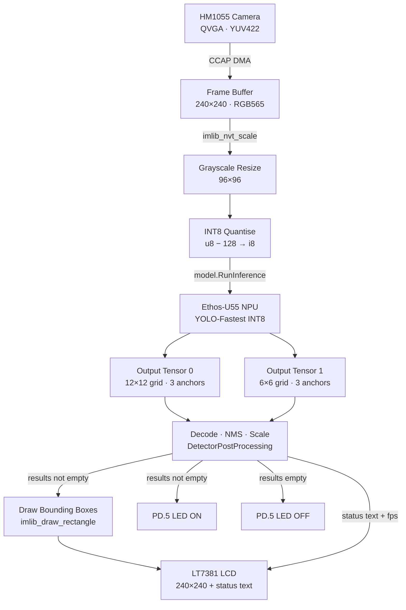

# Real-Time Face Detection on Nuvoton M55M1

Real-time face detection with bounding boxes running on the **Nuvoton NuMaker-X-M55M1** board. Camera frames are captured via CCAP DMA, resized and quantised, then fed to a YOLO-Fastest INT8 model accelerated by the **Arm Ethos-U55 NPU**. Detected faces are drawn as bounding boxes on the LT7381 LCD. A green LED (PD.5) lights up whenever a face is in frame.

---

## Table of Contents

- [Hardware Requirements](#hardware-requirements)
- [System Architecture](#system-architecture)
- [Project Structure](#project-structure)
- [Entry Point — main.cpp](#entry-point--maincpp)
- [Face Detection Pipeline](#face-detection-pipeline)
- [Key Files Reference](#key-files-reference)
- [Memory Layout](#memory-layout)
- [Build Configuration](#build-configuration)
- [GPIO & Pin Assignments](#gpio--pin-assignments)
- [Configuration Reference](#configuration-reference)

---

## Hardware Requirements

| Component | Details |
|---|---|
| MCU Board | Nuvoton NuMaker-X-M55M1 (M55M1H2LJAE) |
| Core | Arm Cortex-M55 @ 220 MHz |
| NPU | Arm Ethos-U55 (MAC=128) |
| Camera | HM1055 CMOS sensor (CON1, rear connector) |
| Display | 800×480 LT7381 LCD panel via 16-bit EBI |
| External Memory | HyperFlash + HyperRAM via SPIM0 |
| Face indicator | Green LED — PD.5 (active-low) |

---

## System Architecture



---

## Project Structure

```
.
│
├── main.cpp                        ← Application entry point & pipeline loop
├── BoardInit.hpp / BoardInit.cpp   ← Clock, NPU, UART, HyperRAM initialisation
├── DetectionResult.hpp             ← Bounding-box result data structure
├── DetectorPostProcessing.hpp      ← YOLO decode + NMS header
├── DetectorPostProcessing.cpp      ← YOLO decode + NMS implementation
├── mpu_config_M55M1.h              ← MPU region attribute helpers
├── board_config.h                  ← Selects LCD panel type
├── NuMicro_M55_Family.yaml         ← Device/memory map for build tools
│
├── Device/                         ← Peripheral drivers
│   ├── include/
│   │   ├── ImageSensor.h           ← Camera capture public API
│   │   ├── Display.h               ← LCD display public API
│   │   └── UVC.h                   ← USB Video Class API (optional)
│   │
│   ├── ImageSensor/
│   │   ├── ImageSensor.c           ← CCAP engine driver (clock, crop, scale, DMA)
│   │   ├── Sensor.h                ← S_SENSOR_INFO abstraction struct
│   │   └── Sensor/
│   │       ├── Sensor_HM1055.c     ← HM1055 sensor init & register table
│   │       └── SWI2C.c / SWI2C.h  ← Bit-bang I2C (PH.2=SCL, PH.3=SDA)
│   │
│   ├── Display/
│   │   ├── Display.c               ← LCD routing & text/rect helpers
│   │   ├── Font8_16.c              ← 8×16 bitmap font
│   │   ├── drv_pdma.c              ← PDMA helper for bulk display transfers
│   │   └── LCD/
│   │       ├── LCD_LT7381.c        ← LT7381 EBI 16-bit driver  ← DEFAULT
│   │       ├── LCD_FSA506.c        ← FSA506 EBI driver (alt)
│   │       └── LCD_ILI9341.c       ← ILI9341 SPI driver (alt)
│   │
│   ├── HyperRAM/
│   │   └── hyperram_code.c         ← HyperFlash/HyperRAM XIP initialisation
│   │
│   └── UVC/
│       ├── UVC.c                   ← USB Video Class streaming (disabled by default)
│       └── descriptors.c           ← USB descriptor tables
│
├── Model/                          ← Neural network model files
│   ├── include/
│   │   └── NNModel.hpp             ← TFLite Micro model wrapper (Ethos-U op resolver)
│   ├── NNModel.cpp                 ← Op resolver implementation (AddEthosU only)
│   └── NN_Model_INT8.tflite.cpp    ← Quantised YOLO-Fastest model as C++ byte array
│
├── NPU/                            ← Arm Ethos-U55 support
│   ├── include/
│   │   ├── ethosu_npu_init.h       ← NPU init API
│   │   └── ethosu_mem_config.h     ← Activation buffer size & section macros
│   ├── ethosu_npu_init.c           ← NPU driver + IRQ setup
│   ├── ethosu_cpu_cache.c          ← Cache maintenance for NPU DMA
│   └── ethosu_profiler.c           ← PMU-based inference profiling
│
├── Pattern/                        ← Static test images (not used at runtime)
│   ├── include/InputFiles.hpp
│   ├── InputFiles.cpp
│   ├── man_in_red_jacket.cpp       ← 96×96 test image
│   └── st_paul_s_cathedral.cpp     ← 96×96 test image
│
├── ProfilerCounter/
│   ├── include/pmu_counter.h
│   └── pmu_counter.c               ← Cortex-M55 PMU cycle counter helpers
│
├── VSCode/                         ← VS Code / CMSIS-Toolbox build files
│   ├── VisualWakeWords.cproject.yml  ← Main project definition (files, flags, libs)
│   └── VisualWakeWords.csolution.yml ← Solution wrapper
│
├── Keil/                           ← Keil uVision project
│   ├── VisualWakeWords.uvprojx
│   └── M55M1.scf                   ← Keil linker scatter file
│
├── GCC/
│   └── M55M1.ld                    ← GCC linker script
│
└── IAR/
    ├── VisualWakeWords.ewp
    └── M55M1.icf                   ← IAR linker configuration
```

---

## Entry Point — [main.cpp](main.cpp)

[main.cpp](main.cpp) is the sole application entry point. It owns the capture/inference/display triple-buffer loop and all top-level orchestration.

### Startup Sequence

```
BoardInit()
  ├── SYS_Init()          — APLL0 → 220 MHz, enable peripheral clocks
  ├── UART6 init          — debug printf
  ├── HyperRAM_Init()     — XIP mode for external flash
  └── arm_ethosu_npu_init()

GPIO_SetMode(PD, BIT5, OUTPUT)   — green LED, default OFF

model.Init(tensorArena, ...)     — load YOLO-Fastest INT8 model into TFLite Micro
InitPreDefMPURegion(...)         — tensor arena → WTRA cache, frame bufs → non-cacheable

ImageSensor_Init()               — CCAP clock 48 MHz, HM1055 register init via SWI2C
ImageSensor_Config(RGB565, 240, 240, keepRatio=true)

Display_Init()
Display_ClearLCD(WHITE)
```

### Main Loop (3 concurrent stages)

Each iteration of the `while(1)` loop advances all three stages in lockstep:

```
┌─────────────────────────────────────────────────────────────┐
│  Iteration N                                                │
│                                                             │
│  Stage 1 — CAPTURE   : DMA camera → emptyFramebuf.data     │
│  Stage 2 — INFERENCE : Process fullFramebuf from iter N-1  │
│  Stage 3 — DISPLAY   : Render infFramebuf from iter N-2    │
│                                                             │
│  Wait for CCAP DMA → mark buffer FULL                      │
└─────────────────────────────────────────────────────────────┘
```

**Frame buffer state machine:**

| State | Meaning |
|---|---|
| `eFRAMEBUF_EMPTY` | Available for DMA capture |
| `eFRAMEBUF_FULL` | Captured frame, waiting for inference |
| `eFRAMEBUF_INF` | Inference complete, waiting for display |

### Key Defines

```c
#define GLCD_WIDTH            240       // Capture & display width (pixels)
#define GLCD_HEIGHT           240       // Capture & display height (pixels)
#define FACE_DETECT_THRESHOLD 0.4f      // Minimum objectness score to report a face
#define ACTIVATION_BUF_SZ     0x00100000 // 1 MB tensor arena (in SRAM, non-cacheable)
#define EACH_PERF_SEC         5         // fps reported every 5 seconds on UART
```

---

## Face Detection Pipeline

### Step 1 — Camera Capture

`ImageSensor_TriggerCapture(addr)` arms the CCAP DMA engine. The HM1055 sensor streams QVGA YUV422 (320×240) over the 8-bit parallel CCAP bus. The CCAP hardware:

- Crops a centred 240×240 region from the 320×240 frame
- Converts YUV422 → RGB565 on the fly
- DMA-transfers the result to the frame buffer in SRAM

`ImageSensor_WaitCaptureDone()` blocks until the DMA finishes (one full frame).

### Step 2 — Pre-processing

```
240×240 RGB565 frame buffer
        │
        ▼  imlib_nvt_scale()   (OpenMV image library, hardware-accelerated)
96×96 Grayscale (luminance only)
        │
        ▼  signed quantise: int8 = uint8 − 128
96×96 INT8 tensor  ──▶  inputTensor->data
```

The grayscale output is written directly into the TFLite input tensor's data buffer — no extra copy.

### Step 3 — NPU Inference

`model.RunInference()` dispatches the graph to the **Ethos-U55 NPU** via the single `AddEthosU()` op resolver. The Vela-compiled model runs entirely on the NPU, with the CPU waiting on an IRQ.

The model produces **two output tensors**:

| Tensor | Grid | Anchors | Contains |
|---|---|---|---|
| `outputTensor0` | 12×12 | 3 per cell | Coarse-scale detections |
| `outputTensor1` | 6×6 | 3 per cell | Fine-scale detections |

Both tensors are INT8 quantised with per-tensor `scale` and `zero_point` read from TFLite metadata.

### Step 4 — Post-Processing ([DetectorPostProcessing.cpp](DetectorPostProcessing.cpp))

```
Raw INT8 output tensors
        │
        ▼  Dequantise: f32 = (int8 − zero_point) × scale
        │
        ▼  For each grid cell × anchor:
        │      objectness  = sigmoid(raw_obj)
        │      if objectness < 0.4 → skip
        │      x_centre    = (grid_col + sigmoid(raw_x)) / grid_W
        │      y_centre    = (grid_row + sigmoid(raw_y)) / grid_H
        │      width       = anchor_w × exp(raw_w) / input_W
        │      height      = anchor_h × exp(raw_h) / input_H
        │
        ▼  Non-Maximum Suppression  (IoU threshold = 0.45)
        │
        ▼  Scale coordinates from 96×96 input space → 240×240 frame space
        │
        ▼  Clip to image bounds
        │
        └─▶  vector<DetectionResult>  { x0, y0, w, h, score }
```

### Step 5 — Display & LED

```cpp
if (!results.empty())
{
    for each result:
        imlib_draw_rectangle(image, x0, y0, w, h, BLUE, thickness=2)
    PD5 = 0;   // GREEN LED ON  (active-low)
}
else
{
    PD5 = 1;   // GREEN LED OFF
}

Display_FillRect(frameImage, rect, scale=1)          // push frame to LCD
Display_PutText("Face Detected: Yes/No", ...)        // status text below image
```

Frame rate is computed over a 5-second window and printed both to UART and the LCD.

---

## Key Files Reference

| File | Role |
|---|---|
| [main.cpp](main.cpp) | Application entry, pipeline loop, LED & display control |
| [BoardInit.cpp](BoardInit.cpp) | PLL, clocks, NPU, HyperRAM, UART init |
| [DetectionResult.hpp](DetectionResult.hpp) | `DetectionResult` struct: `{x0, y0, w, h, score}` |
| [DetectorPostProcessing.cpp](DetectorPostProcessing.cpp) | Dequantise → decode → NMS → scale bounding boxes |
| [Device/ImageSensor/ImageSensor.c](Device/ImageSensor/ImageSensor.c) | CCAP engine: clock, crop window, packet scaler, DMA |
| [Device/ImageSensor/Sensor/Sensor_HM1055.c](Device/ImageSensor/Sensor/Sensor_HM1055.c) | HM1055 reset, register init table, I2C writes |
| [Device/ImageSensor/Sensor/SWI2C.c](Device/ImageSensor/Sensor/SWI2C.c) | Bit-bang I2C on PH.2 / PH.3 for sensor control |
| [Device/Display/Display.c](Device/Display/Display.c) | `FillRect`, `PutText`, `ClearRect` — routes to active LCD driver |
| [Device/Display/LCD/LCD_LT7381.c](Device/Display/LCD/LCD_LT7381.c) | LT7381 EBI 16-bit low-level commands |
| [Device/Display/Font8_16.c](Device/Display/Font8_16.c) | 8×16 bitmap font used by `Display_PutText` |
| [Model/NNModel.cpp](Model/NNModel.cpp) | TFLite Micro op resolver — `AddEthosU()` only |
| [Model/NN_Model_INT8.tflite.cpp](Model/NN_Model_INT8.tflite.cpp) | YOLO-Fastest model embedded as `uint8_t[]` array |
| [NPU/ethosu_npu_init.c](NPU/ethosu_npu_init.c) | Ethos-U55 driver init + NVIC IRQ setup |
| [NPU/ethosu_cpu_cache.c](NPU/ethosu_cpu_cache.c) | Cache flush/invalidate before/after NPU DMA |
| [NPU/ethosu_profiler.c](NPU/ethosu_profiler.c) | PMU cycle counter integration for profiling |
| [ProfilerCounter/pmu_counter.c](ProfilerCounter/pmu_counter.c) | `pmu_get_systick_Count()` used for fps measurement |
| [mpu_config_M55M1.h](mpu_config_M55M1.h) | MPU attribute macros (WTRA, non-cacheable, device) |
| [VSCode/VisualWakeWords.cproject.yml](VSCode/VisualWakeWords.cproject.yml) | Source list, include paths, defines, library paths |
| [GCC/M55M1.ld](GCC/M55M1.ld) | GCC linker script — memory region assignments |
| [Keil/M55M1.scf](Keil/M55M1.scf) | Keil scatter file — memory region assignments |

---

## Memory Layout

| Region | Base Address | Size | Used For |
|---|---|---|---|
| ITCM | `0x0000_0000` | 64 KB | OpenMV library hot paths |
| FLASH | `0x0010_0000` | 2 MB | Code, model, read-only data |
| DTCM | `0x2000_0000` | 128 KB | Stack (40 KB), heap (40 KB) |
| SRAM01 | `0x2010_0000` | 1 MB | Tensor arena, frame buffers |
| SRAM2 | `0x2020_0000` | 320 KB | Additional SRAM |
| EBI | `0x6000_0000` | 3 MB | LCD controller data bus |
| HyperFlash (XIP) | `0x8200_0000` | 32 MB | Execute-in-place firmware |

**SRAM01 allocations (from [main.cpp](main.cpp)):**

```
.bss.sram.data
 ├── fb_array        ← OMV frame buffer + allocator   (~115 KB)
 ├── jpeg_array      ← JPEG scratch buffer
 └── frame_buf1      ← Second frame buffer             (~115 KB)

.bss.NoInit.activation_buf_sram
 └── tensorArena     ← TFLite Micro tensor arena        (1 MB)
```

The tensor arena is marked **WTRA cacheable** by the MPU; frame buffers are marked **non-cacheable** so the NPU and CPU see coherent data without manual flushes.

---

## Build Configuration

### VS Code / CMSIS-Toolbox (recommended)

1. Install the [Nuvoton VS Code extension](https://marketplace.visualstudio.com/items?itemName=Nuvoton.nuvoton-vscode-tools).
2. Open [VSCode/VisualWakeWords.cproject.yml](VSCode/VisualWakeWords.cproject.yml).
3. **Build:** `Ctrl+Shift+B` → *Build*.
4. **Flash & Debug:** F5 (uses [VSCode/.vscode/launch.json](VSCode/.vscode/launch.json)).

### Keil uVision

Open [Keil/VisualWakeWords.uvprojx](Keil/VisualWakeWords.uvprojx), select the target, Build (F7), then Flash (F8).

### IAR Embedded Workbench

Open [IAR/VisualWakeWords.ewp](IAR/VisualWakeWords.ewp), Build All, then Download & Debug.

### Compiler Flags (key ones)

```
-std=c++14
-ffunction-sections -fdata-sections   (dead-code strip)
--specs=nano.specs --specs=nosys.specs
-Wl,--gc-sections
```

### Linked Libraries

| Library | Purpose |
|---|---|
| `tflu` | TensorFlow Lite Micro for Ethos-U |
| `CMSIS_DSP` | DSP intrinsics |
| `CMSIS_NN` | Neural-network kernels |
| `omv` | OpenMV image processing (scale, draw, vflip) |

### Compile-time Feature Switches ([main.cpp](main.cpp))

```c
#define __USE_CCAP__      // Enable camera capture     (default: ON)
#define __USE_DISPLAY__   // Enable LCD output          (default: ON)
// #define __USE_UVC__    // Enable USB video streaming (default: OFF)
// #define __PROFILE__    // Enable inference profiling (default: OFF)
```

---

## GPIO & Pin Assignments

### Camera — CCAP Parallel Interface (CON1, rear connector)

| CON1 Pin | Signal | MCU GPIO |
|---|---|---|
| 1, 2 | GND | — |
| 3 | CCAP_PIXCLK | PG.9 |
| 4 | CCAP_SCLK (XCLK out) | PG.10 |
| 5–12 | CCAP_DATA[0:7] | PF.7–PF.11, PG.4, PG.3, PG.2 |
| 15 | CCAP_VSYNC | PG.12 |
| 16 | CCAP_HSYNC | PD.7 |
| 17 | PWDN | PD.12 |
| 18 | RST | PG.11 |
| 19 | I2C SCL | PH.2 |
| 20 | I2C SDA | PH.3 |
| 21, 22 | 3.3 V | — |
| 23, 24 | GND | — |

### LEDs

| LED | GPIO | Logic |
|---|---|---|
| Green (face detected) | PD.5 | Active-low: LOW = ON |
| Yellow | PD.6 | Active-low |
| Red | PH.4 | Active-low |

### Debug UART

| Signal | GPIO |
|---|---|
| TX | UART6 TX |
| RX | UART6 RX |
| Baud | 115200 8N1 |

---

## Configuration Reference

| Symbol | Location | Default | Description |
|---|---|---|---|
| `GLCD_WIDTH` | [main.cpp](main.cpp) | `240` | Capture & display width |
| `GLCD_HEIGHT` | [main.cpp](main.cpp) | `240` | Capture & display height |
| `FACE_DETECT_THRESHOLD` | [main.cpp](main.cpp) | `0.4f` | Minimum objectness to report face |
| `ACTIVATION_BUF_SZ` | [VSCode/VisualWakeWords.cproject.yml](VSCode/VisualWakeWords.cproject.yml) | `0x00100000` | Tensor arena size (1 MB) |
| `NUM_FRAMEBUF` | [main.cpp](main.cpp) | `2` | Double-buffering depth |
| `EACH_PERF_SEC` | [main.cpp](main.cpp) | `5` | fps report interval (seconds) |
| `LT7381_LCD_PANEL` | [board_config.h](board_config.h) | defined | Selects LT7381 EBI LCD driver |
| `NMS_IOU_THRESHOLD` | [DetectorPostProcessing.cpp](DetectorPostProcessing.cpp) | `0.45` | NMS suppression overlap threshold |

---

## UART Debug Output

Connect a serial terminal at **115200 8N1** to UART6. On startup you will see:

```
CCAP   engine clock: 48000000 Hz
Target sensor clock: 48000000 Hz.
Actual sensor clock: 48000000 Hz. Divider=0+1
sensor input width 320
sensor input height 240
scaled image width 240
scaled image height 240
```

Every 5 seconds:
```
Total inference rate: 6 fps
```

If the sensor fails to initialise:
```
HM1055 init failed – wrong chip ID!
```
